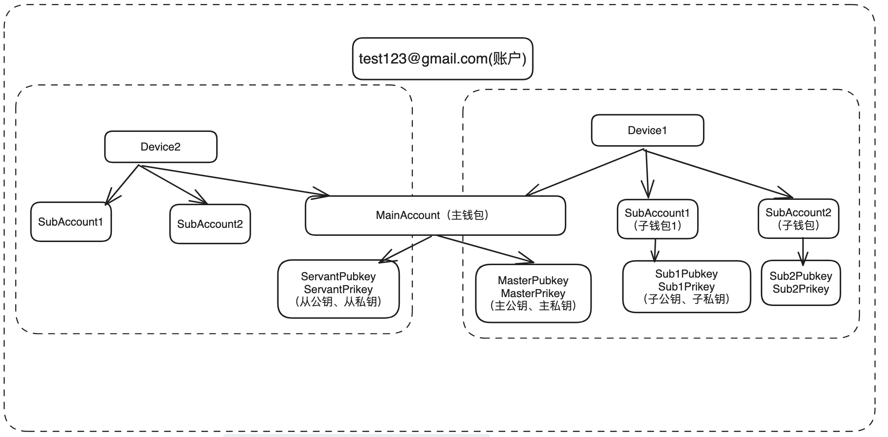
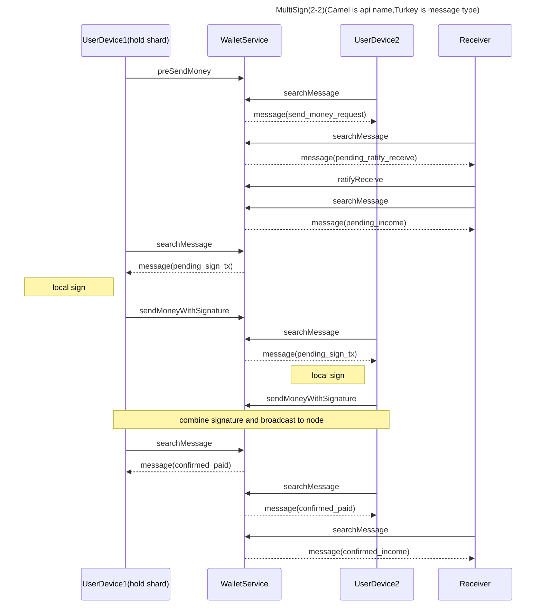

Wallet Structure

Flow diagram
---------------

```mermaid
sequenceDiagram
Title MultiSign(2-2)(Camel is api name,Turkey is message type)

participant Device1 as UserDevice1(hold shard)
participant Service as WalletService
participant Device2 as UserDevice2
participant Receiver as Receiver


Device1 ->> Service: preSendMoney
Device2 ->> Service:  searchMessage
Service -->> Device2: message(send_money_request) 
Receiver ->> Service:  searchMessage
Service -->> Receiver: message(pending_ratify_receive) 
Receiver ->> Service:  ratifyReceive
Receiver ->> Service:  searchMessage
Service -->> Receiver: message(pending_income)
Device1 ->> Service: searchMessage
Service -->> Device1: message(pending_sign_tx)
Note left of Device1 : local sign
Device1 ->> Service: sendMoneyWithSignature
Device2 ->> Service:  searchMessage
Service -->> Device2: message(pending_sign_tx)
Note left of Device2 : local sign
Device2 ->> Service: sendMoneyWithSignature
Note over Device1,Device2 : combine signature and broadcast to node
Device1 ->> Service:  searchMessage
Service -->> Device1: message(confirmed_paid)
Device2 ->> Service:  searchMessage
Service -->> Device2: message(confirmed_paid)
Receiver ->> Service:  searchMessage
Service -->> Receiver: message(confirmed_income)
```
